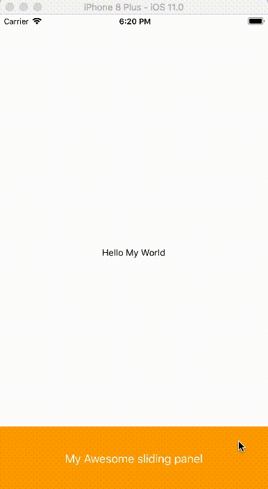

# React Native Sliding panel (up and down) - Android and IOS
An Awesome fully Customizable library of react native for sliding panels purely implemented in Javascript. Works exceptionally well on **android and ios**.



# Features (What makes this library different)

> #### *Easily Assemble itself into your react native project*
> #### *One library for both sliding up and sliding down panels.*
> #### *Customizable Animatable and Draggable.*
> #### *Extremely simple usage and implementation.*
> #### *Provides maximum methods for dealing with every scenarios in sliding panels.*
> #### *Constantly updating and improvizing to provide best experience to all the developers.*


# Support

 We will be always available to hear every possible issue and to fix every reported bug. You can even directly report the issue/concern/query/suggestion at **abhijeetashapure@gmail.com**

# Installation

```
npm install react-native-sliding-up-down-panels --save
```

Copy it and paste into the terminal in your project directory. For more information on npm install, please visit their [official page](https://docs.npmjs.com/getting-started/installing-npm-packages-locally)

Note : We will soon provide the installation using yarn

# Minimal Example

#### Before start please note : 

 1. Always Put flex: 1 on the root container component style in which you are using < SlidingPanel />.
  2. Always use prop **headerLayoutHeight** to mention the height of the sliding panel header.

```
import React, { Component } from 'react';
import {
  StyleSheet,
  Text,
  View,
  Dimensions,
} from 'react-native';
const { width, height } = Dimensions.get('window');

import SlidingPanel from 'react-native-sliding-up-down-panels';


export default class App extends Component {
  render() {
    return (
      <View style={styles.container}>                      
        
        <View style={styles.bodyViewStyle}>
          <Text>Hello My World</Text>
        </View>
        
        <SlidingPanel
            headerLayoutHeight = {100}
            headerLayout = { () =>
                <View style={styles.headerLayoutStyle}>
                  <Text style={styles.commonTextStyle}>My Awesome sliding panel</Text>
                </View>
            }
            slidingPanelLayout = { () =>
                <View style={styles.slidingPanelLayoutStyle}>
                  <Text style={styles.commonTextStyle}>The best thing about me is you</Text>
                </View>
            }
        />
      </View>
    );
  }
}

const styles = StyleSheet.create({
  container: {
    flex: 1,
  },
  bodyViewStyle: {
    flex: 1,
    justifyContent: 'center', 
    alignItems: 'center',
  },
  headerLayoutStyle: {
    width, 
    height: 100, 
    backgroundColor: 'orange', 
    justifyContent: 'center', 
    alignItems: 'center',
  },
  slidingPanelLayoutStyle: {
    width, 
    height, 
    backgroundColor: '#7E52A0', 
    justifyContent: 'center', 
    alignItems: 'center',
  },
  commonTextStyle: {
    color: 'white', 
    fontSize: 18,
  },
});

```
If you are wrapping header layout inside a view, please make sure the height of that view is equal to headerLayoutHeight prop.

# Props


| Property | Type | Description | Platform
| --- | --- | --- | --- |
| headerLayoutHeight | number | Header height of sliding panel | android, ios
| headerLayout| function | Header Layout of sliding panel | android, ios
| slidingPanelLayout | function | Panel Layout of sliding panel | android, ios
| AnimationSpeed | number | Animation speed, (in millisecond) | android, ios
| slidingPanelLayoutHeight |number | Panel height of sliding panel | android, ios
| panelPosition | string | "top" or "bottom" | android, ios
| visible | booolean | to show/hide sliding panel | android, ios
| allowDragging | booolean | allow sliding panel to drag | android, ios
| allowAnimation | booolean | allow sliding panel to animate | android, ios
| onDragStart | function(event, gestureState) | returns event, gestureState | android, ios
| onDragStop | function(event, gestureState) | returns event, gestureState | android, ios
| onDrag | function(event, gestureState) | returns event, gestureState | android, ios
| onAnimationStart | function | triggers when panel animation starts | android, ios
| onAnimationStop | function | triggers when panel animation stops | android, ios


# Methods

| Method Name | Description | Platform
| --- | --- | --- |
| onRequestStart | panel animation starts, sliding panel opens | android, ios
| onRequestClose | panel animation stops, sliding panel stops | android, ios

# What's next  (Our promise)

In the next version, We will upgrade library to the following features.

- Installation using yarn.
- Sliding the panel upto a particular height.
- Left and Right sliding panels
- Drop down panels,  (Wooo!!) 
- Bug fixes
